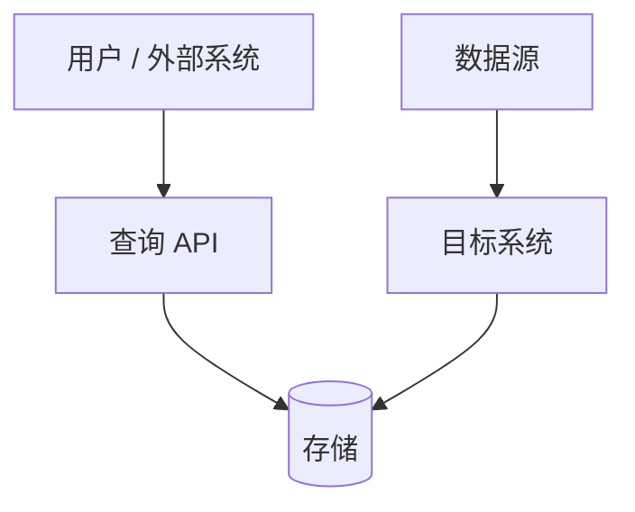

# Architecture Capability Research

Use this skill when the user asks to research an architecture layer, compare existing open-source or managed products, determine whether existing projects cover a capability, or turn research into architecture diagrams and decision documents.

Typical triggers:

- “调研有没有现成项目”
- “总结这个服务的架构设计”
- “对比这些项目能力边界”
- “画一个模块依赖图 / 架构图”
- “输出到 ~/Document”
- “不要结合当前项目，只看这一层能力”

## Non-goals

- Do not implement application code.
- Do not inspect private or local project code unless the user explicitly asks.
- Do not recommend a project only because it is popular.
- Do not treat vendor marketing claims as implementation proof.
- Do not write files unless the user asks for file output.

## Research Workflow

1. Restate the research target as a capability boundary.
2. Separate the target into capability categories, for example ingestion, persistence, query, consistency, operations, and external integrations.
3. Discover candidates from official docs, GitHub repos, product docs, and public examples.
4. For each candidate, classify it as one of:
   - turnkey product;
   - open-source deployable system;
   - framework;
   - ETL/data source;
   - managed pipeline;
   - reference-only project.
5. Extract facts from sources and keep inference separate.
6. Compare coverage against the target capability boundary.
7. Identify gaps, especially around persistence, query APIs, reorg/finality, backfill, live ingestion, and operational recovery.
8. Produce a concise recommendation and a Mermaid module dependency diagram when architecture is involved.
9. If writing a document, store it under `~/Document` unless the user gives another path.

## Source Strategy

Use public sources in this order:

1. Official docs for product contracts and stated capabilities.
2. GitHub source for implementation details.
3. GitHub examples/templates for practical usage shape.
4. Issues, PRs, and releases for maturity and risk signals.
5. Web search only to discover candidates or locate official references.

When useful, load or delegate with these skills:

- `github-research` for repository/product evaluation.
- `github-code-search` for implementation examples and source-level evidence.
- `batched-search-discipline` for local or cloned-repo searching.
- `agent-harness-construction` when refining the research workflow or skill itself.

## Output Templates

### Capability Boundary Matrix

| Candidate | Type | Covers | Does Not Cover | Persistence | Query API | Consistency/Reorg | Operational Burden | Verdict |
|---|---|---|---|---|---|---|---|---|

### Architecture Summary

Use this structure:

1. Target capability boundary.
2. Candidate categories.
3. Best-fit candidates.
4. Non-fit candidates and why.
5. Recommended architecture shape.
6. Source-backed gaps and risks.

### Mermaid Diagram Requirements

For overview diagrams:

For module dependency diagrams:

- Prefer 5 to 8 major modules per diagram.
- Split oversized diagrams into multiple smaller diagrams for Obsidian compatibility.
- Use Chinese labels when the user is working in Chinese.
- Label arrows with dependency meaning, not just direction.
- Use storage cylinders for databases and queues.
- Keep module boxes short: one name plus 1 to 3 capability bullets.

## Documentation Convention

When the user asks to write a document:

- Default directory: `~/Document`.
- Use descriptive kebab-case filenames.
- Put the overview diagram before detailed diagrams.
- Keep the main diagram high-level; move detailed dependency graphs into later sections.
- Prefer Obsidian-friendly Mermaid: smaller graphs, fewer nested subgraphs, fewer long labels.

## Evidence Rules

- Mark facts as source-backed when they come from docs, source, README, examples, issues, PRs, or releases.
- Mark architecture interpretation as inference.
- Do not claim “full coverage” unless the source confirms all relevant categories.
- If support differs by chain, product tier, endpoint, or provider, say so.
- If a candidate is a framework, do not describe it as turnkey.
- If a managed product can deliver data but not own the query model, mark it as “pipeline/source,” not “complete service.”

## Quality Checklist

Before finalizing research output, verify:

- The target capability boundary is explicit.
- Candidates are classified by type.
- Each recommendation has evidence or is clearly marked as inference.
- Non-fit projects are explained, not just omitted.
- Architecture diagrams show module dependencies, not only data flow.
- Written docs are under `~/Document` when requested.
- Oversized Mermaid diagrams are split for Obsidian readability.

## Failure Modes and Recovery

- If public search is noisy, narrow by exact capability terms and official project names.
- If docs and source disagree, prefer source for implementation behavior and docs for product contract, then explain the conflict.
- If the user changes the capability boundary, stop using old conclusions and reclassify candidates.
- If a diagram renders too small in Obsidian, split it by overview, ingestion, derivation, query, and operations.
- If local project inspection is forbidden, do not use local code search even if search-mode asks for it.
